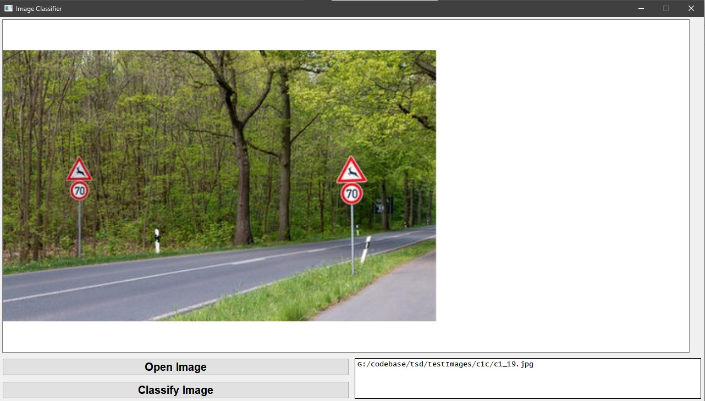
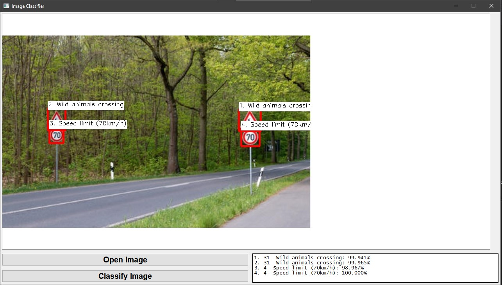

# 2Stage-Traffic-Sign-Classifier
Traffic Sign Classifier using YOLO object Detection and CNN classifier

This traffic sign classifier classifies the traffic sign images in two stages. It uses YOLOv3 for object detection and classifies the traffic signs in 4 classes, prohibitory, mandatory, danger and other. The image is croped, prosessed and is given as input to a 26 layered CNN model. The CNN classifies the image into 43 classes.

The YOLOv3 model is a model from darknet and is pretrained on COCO image dataset. For the model to work on traffic signs it was trained on GTSDB dataset for 8000 epochs, and the CNN model was trained on GTSRB for 30 epochs.


## Requirements
* Window or Linux,
* Python 3,
* Python Libraries - 
  * Numpy, 
  * Open CV2, 
  * PyQT5,
  * Tensorflow

## Files and directories: 

* final_models - This folder containes the final trained models, configuration files and text files used during classification.
  * category.names: This file containes the 4 categories in which the YOLO classifies the traffic sign.
  * classes.txt: This file containes the list of 43 classes of traffic signs in which the CNN classifies the Croped traffic signs.
  * cnn26.h5: This is the trained CNN model.
  * yolov3.cfg: This is the configuration file for the YOLOv3 model, containing the information of all layers in YOLO
  * yolov3.weights: This is the trained YOLOv3 model.


  Due the large file size, the two models are not uploaded to the Github repository, these two files can be obtained from this [Google Drive link](https://drive.google.com/file/d/1TuQ3mib2u4MDKnL_uyQtXg0hvG_CFkze/view?usp=sharing)
* result - The result image file with bounding boxes and result text file will be stored here after classification.
  * result.jpg: Result Image with bounding boxes, and the respective classification.
  * result_out.txt: Result in text format.
* testImages - 
  * c1c: images which are correctly classified.
  * incorrect: images which are incorrectly classified.
  * no_detection: images for which the YOLO does not detect any traffic sign.
  * partial: iamges for which the YOLO detects only few traffic signs or are incorrectly classified.
* classify.py: The python program which loads the YOLO and CNN model and does the actual detection and classificaiton.
* loader.py: The python program which loads the UI and connects the UI events with the classificaiton part.
* ui.py: The python code for the user interface using PyQT5.

## Run the code:
To run code, type the following in terminal inside the root folder
```
py loader.py
```
This will load the UI file and display the Window. From here on the process is self explanatory.

## Input and Output

Here is a sample input and ouput screenshots while running the UI -

Input


Output

